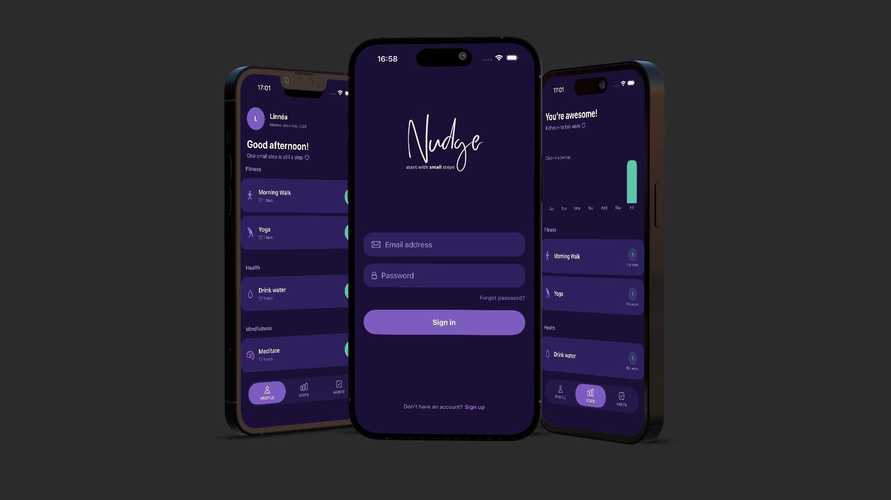
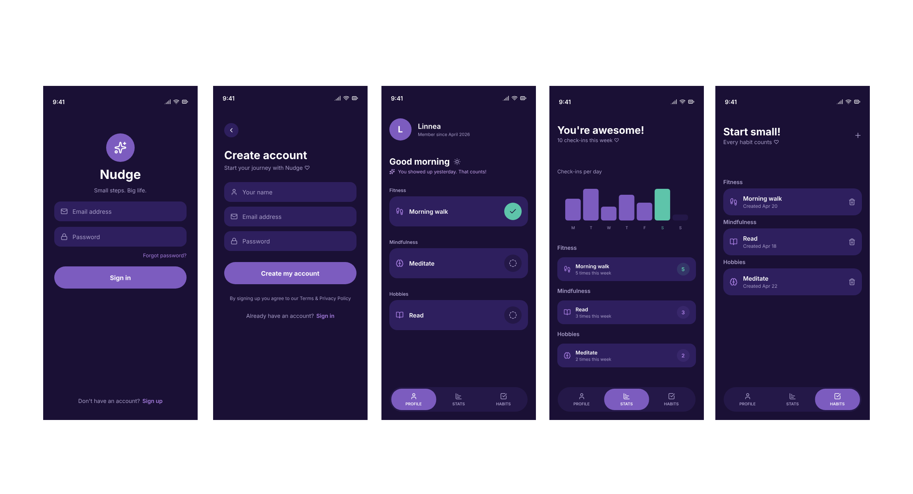
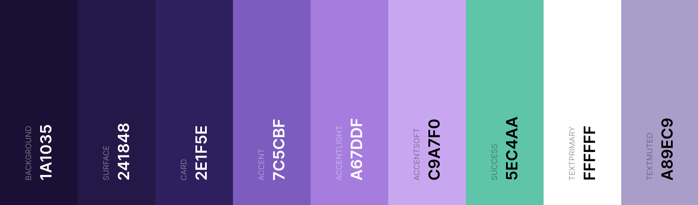

# Nudge



## Table of Contents
- [UX](#ux)
  - [App Purpose](#app-purpose)
  - [App Goal](#app-goal)
  - [Developer Goals](#developer-goals)
  - [User Goals](#user-goals)
  - [Audience](#audience)
  - [Communication](#communication)
  - [Interaction & Experience Principles](#interaction--experience-principles)
- [Agile Planning](#agile-planning)
  - [Epics & User Stories](#epics--user-stories)
  - [Implemented User Stories](#implemented-user-stories)
  - [Not Implemented User Stories](#not-implemented-user-stories)
  - [MoSCoW Prioritization](#moscow-prioritization)
  - [Kanban Board](#kanban-board)
- [Design](#design)
  - [Prototype](#prototype)
  - [Colour Scheme](#colour-scheme)
  - [Fonts](#fonts)
- [Features](#features)
  - [Existing Features](#existing-features)
  - [Future Features](#future-features)
- [Testing](#testing)
  - [Manual Testing](#manual-testing)
  - [Bugs](#bugs)
  - [Unfixed Bugs](#unfixed-bugs)
- [Technologies](#technologies)
  - [Main Languages Used](#main-languages-used)
  - [Architecture](#architecture)
  - [Setup & Installation](#setup--installation)
- [Credits](#credits)

## UX

### App Purpose

Nudge is a habit tracker app designed specifically for users with NPF — built around how the brain actually works, not how neurotypical apps assume it does.

The app lets users create their own habits, check in daily, and follow their progress through a weekly overview. The purpose is to support small, consistent steps without creating pressure, guilt, or the feeling of failure.

### App Goal

The main goal is to build a habit tracker that feels kind, motivating, and never punishing. The app should:
- Let users create, edit, and delete their own habits
- Let users check in a habit as done for today
- Show a weekly stats overview with SwiftUI Charts
- Show streak per habit in a discrete, non-dominant way
- Store all data in Firebase Firestore with authentication via Firebase Auth

### Developer Goals

To build a stable, well-structured, and polished iOS application using modern Swift development practices.

Specific goals include:
- Apply MVVM architecture with a clean separation of concerns
- Use protocol-driven service layers for Firebase, making the backend swappable
- Use `@Observable` and `@Environment` for modern, clean state management
- Maintain clean, readable, and consistently styled code throughout
- Manage all work through GitHub with branches, pull requests, and meaningful commit history

### User Goals

Users with NPF want to:
- Add their own habits without being overwhelmed
- Check in easily and feel rewarded for showing up
- See their progress without being confronted with what they missed
- Use an app that never shouts at them or makes them feel bad

### Audience

Nudge is aimed at people with NPF/ADHD who want a habit tracker that works with their brain. The app is also suitable for anyone who finds traditional habit trackers stressful or discouraging.

### Communication

The app communicates through a calm dark purple theme, warm motivational messages, and positive-only feedback. There are no red indicators, no streaks displayed prominently, and no empty states that feel accusatory.

Streak exists in the code and is shown discretely with a small heart icon — only when the streak is above zero. The focus is always on what the user has done, never on what they missed.

### Interaction & Experience Principles

- **Minimal friction** — check in with one tap, no confirmation needed
- **Positive only** — the app never shows zeros or failure states prominently
- **Warm tone** — motivational messages rotate based on total check-ins
- **Consistent visual language** — dark purple theme throughout with no jarring transitions
- **NPF-friendly** — discrete streak, no dominant nag indicators, habits grouped by category to reduce overwhelm

[Back to top](#nudge)

## Agile Planning
The development of Nudge was planned using Agile methodology. All functionality was divided into Epics and refined into User Stories, each assigned a MoSCoW priority and tracked on a GitHub Projects Kanban board.

### Epics & User Stories

#### EPIC 1 — Core Setup
Firebase configuration, design system, folder structure, string catalog, and constants.

[View Epic 1](https://github.com/Linnea87/nudge/issues/6)

*User Stories:*
- [Sensitive files never end up in the repo](https://github.com/Linnea87/nudge/issues/26)
- [All colors defined in one place](https://github.com/Linnea87/nudge/issues/27)
- [Named constants for spacing and sizing](https://github.com/Linnea87/nudge/issues/28)
- [All app text managed in a string catalog](https://github.com/Linnea87/nudge/issues/29)
- [Clear MVVM folder structure in place](https://github.com/Linnea87/nudge/issues/30)
- [The app connects to the backend on startup](https://github.com/Linnea87/nudge/issues/31)
- [Cloud sync handles data across devices](https://github.com/Linnea87/nudge/issues/35) *(wont-have)*

#### EPIC 2 — Authentication
Sign in, sign up, and sign out with Firebase Auth.

[View Epic 2](https://github.com/Linnea87/nudge/issues/7)

*User Stories:*
- [Sign in to my account](https://github.com/Linnea87/nudge/issues/14)
- [Create a new account](https://github.com/Linnea87/nudge/issues/15)
- [Sign out of my account](https://github.com/Linnea87/nudge/issues/16)
- [Sign in with my Google account](https://github.com/Linnea87/nudge/issues/32) *(could-have)*

#### EPIC 3 — Habits
Create, view, edit, and delete habits.

[View Epic 3](https://github.com/Linnea87/nudge/issues/8)

*User Stories:*
- [Manage my habits](https://github.com/Linnea87/nudge/issues/17)
- [See all my habits at a glance](https://github.com/Linnea87/nudge/issues/18)
- [Create a new habit with name and icon](https://github.com/Linnea87/nudge/issues/19)
- [See my session count per habit](https://github.com/Linnea87/nudge/issues/20)
- [Get inspired when creating a new habit](https://github.com/Linnea87/nudge/issues/33) *(could-have)*

#### EPIC 4 — Profile
Daily check-in, motivational messages, and streak display.

[View Epic 4](https://github.com/Linnea87/nudge/issues/9)

*User Stories:*
- [Check in a habit for today](https://github.com/Linnea87/nudge/issues/21)
- [Feel rewarded when checking in](https://github.com/Linnea87/nudge/issues/22)
- [Read a kind message on my profile](https://github.com/Linnea87/nudge/issues/23)
- [Get reminded about my habits at the right time](https://github.com/Linnea87/nudge/issues/34) *(wont-have)*

#### EPIC 5 — Statistics
Weekly overview with SwiftUI Charts.

[View Epic 5](https://github.com/Linnea87/nudge/issues/10)

*User Stories:*
- [See accurate stats for each habit](https://github.com/Linnea87/nudge/issues/24)
- [See my progress in a chart](https://github.com/Linnea87/nudge/issues/25)

### Implemented User Stories

The following user stories were successfully implemented during the development of Nudge. They cover the full app flow — from authentication and habit management to daily check-ins, streak tracking, and weekly statistics. Each story contributed directly to building a complete, functional, and NPF-friendly habit tracker aligned with the project's goals.

- [Sensitive files never end up in the repo](https://github.com/Linnea87/nudge/issues/26)
- [All colors defined in one place](https://github.com/Linnea87/nudge/issues/27)
- [Named constants for spacing and sizing](https://github.com/Linnea87/nudge/issues/28)
- [All app text managed in a string catalog](https://github.com/Linnea87/nudge/issues/29)
- [Clear MVVM folder structure in place](https://github.com/Linnea87/nudge/issues/30)
- [The app connects to the backend on startup](https://github.com/Linnea87/nudge/issues/31)
- [Sign in to my account](https://github.com/Linnea87/nudge/issues/14)
- [Create a new account](https://github.com/Linnea87/nudge/issues/15)
- [Sign out of my account](https://github.com/Linnea87/nudge/issues/16)
- [Manage my habits](https://github.com/Linnea87/nudge/issues/17)
- [See all my habits at a glance](https://github.com/Linnea87/nudge/issues/18)
- [Create a new habit with name and icon](https://github.com/Linnea87/nudge/issues/19)
- [See my session count per habit](https://github.com/Linnea87/nudge/issues/20)
- [Check in a habit for today](https://github.com/Linnea87/nudge/issues/21)
- [Feel rewarded when checking in](https://github.com/Linnea87/nudge/issues/22)
- [Read a kind message on my profile](https://github.com/Linnea87/nudge/issues/23)
- [See accurate stats for each habit](https://github.com/Linnea87/nudge/issues/24)
- [See my progress in a chart](https://github.com/Linnea87/nudge/issues/25)

### Not Implemented User Stories

The following user stories were intentionally not implemented. They were considered outside the scope for the MVP and may be included in a future version.

#### Could Have
- [Sign in with my Google account](https://github.com/Linnea87/nudge/issues/32)
- [Get inspired when creating a new habit](https://github.com/Linnea87/nudge/issues/33)

#### Won't Have
- [Get reminded about my habits at the right time](https://github.com/Linnea87/nudge/issues/34)
- [Cloud sync handles data across devices](https://github.com/Linnea87/nudge/issues/35)

### MoSCoW Prioritization

| Priority | Description |
|----------|-------------|
| **Must Have** | Core setup, authentication, habit CRUD, daily check-in, error handling |
| **Should Have** | Weekly stats, chart visualization, streak display |
| **Could Have** | Motivational messages, category grouping, edit habit, Google sign-in, habit suggestions |
| **Won't Have** | Push notifications, cloud sync across devices |

### Kanban Board
The project was organized using a [GitHub Projects Kanban board](https://github.com/users/Linnea87/projects/16) with the following workflow:

**Backlog → Todo → In Progress → Done**

[Back to top](#nudge)

## Design

### Prototype
The app was designed in [Pencil](https://www.pencil.di) before development began to illustrate the core layout and screen structure of the app.



### Colour Scheme
The application uses a dark purple color palette designed to feel calm, warm, and focused — reducing visual noise for NPF users while maintaining a strong, distinctive identity. 

- **Background** — A deep dark purple creating an immersive atmosphere and reducing eye strain
- **Surface** — A slightly lighter tone used for elevated elements and the tab bar, providing subtle visual separation
- **Card** — Used for habit rows and form fields, sitting one step above the surface
- **Accent** — The main brand color used for buttons, active tab states, and key interactive elements
- **AccentLight** — Used for habit icons and secondary highlights
- **AccentSoft** — Used for motivational text and subtle decorative elements
- **Success** — A teal green used for completed check-ins, today's chart bar, and positive feedback
- **TextPrimary** — White, used for all main headings and content text
- **TextMuted** — A soft lavender used for secondary text, subtitles, and inactive states




All colors are defined in `Theme.swift` and referenced via `Assets.xcassets`. No color is ever hardcoded in a view.

### Fonts
The app uses the system default **SF Pro** via SwiftUI's standard font system. Font sizes are standardized through `FontSize` constants in `Constants.swift`, ranging from `xs` (10pt) to `display` (26pt). Icon sizes are similarly standardized in `IconSize`.

[Back to top](#nudge)

## Features

### Existing Features
- **Sign In & Sign Up** — Firebase Auth with email and password. Display name is set at sign up and shown throughout the app.
- **Custom Wordmark** — A hand-designed logo on the sign in screen.
- **Profile Screen** — Daily habit check-in with greeting based on time of day, motivational message, and habits grouped by category.
- **Streak Display** — Discrete streak per habit shown with a heart icon, only when streak is above zero. Designed to motivate without pressuring.
- **Habits Screen** — Full habit management with add, edit (swipe), and delete (swipe). Save button disabled until all fields are filled.
- **Stats Screen** — Weekly overview with SwiftUI Charts. Bar chart shows check-ins per day for the last 7 days. Today's bar is always green. Per-habit weekly count shown as a circle badge, only when above zero.
- **Category Grouping** — Habits are grouped into categories (Fitness, Health, Mindfulness, Hobbies) across all three main screens.
- **Error Handling** — All Firebase operations are wrapped in `do/try/catch`. Errors are shown via `.alert` in the UI. The app never crashes silently.
- **Localizable Strings** — All user-facing text is managed in `Localizable.xcstrings`. No hardcoded strings in views.

### Future Features
- **Firebase cloud sync** across devices
- **Google Sign In**
- **Push notifications** for habit reminders
- **Habit suggestions** when creating a new habit
- **Streak celebration animations**

[Back to top](#nudge)

## Testing

### Manual Testing

| Feature Area | Description | Status |
|:---|:---|:---:|
| **Sign In** | Verified that sign in works with valid credentials and shows an error alert on failure | ✅ |
| **Sign Up** | Verified that account creation sets display name correctly in Firebase Auth | ✅ |
| **Sign Out** | Verified that sign out clears session and returns to sign in screen | ✅ |
| **Add Habit** | Verified that save button is disabled until name, category and icon are all filled in | ✅ |
| **Edit Habit** | Verified that swipe-to-edit opens form pre-filled with existing values | ✅ |
| **Delete Habit** | Verified that swipe-to-delete removes the habit from Firestore and the list | ✅ |
| **Check In** | Verified that tapping a habit marks it as done and disables the button for today | ✅ |
| **Streak** | Verified that streak increases on consecutive days and is hidden when zero | ✅ |
| **Stats Chart** | Verified that the bar chart reflects actual check-in data and today's bar is green | ✅ |
| **Weekly Count** | Verified that per-habit circle badge only appears when count is above zero | ✅ |
| **Error Handling** | Verified that Firebase errors are caught and displayed as alerts, not crashes | ✅ |
| **Navigation** | Verified full flow between Profile, Stats, and Habits via tab bar | ✅ |

### Bugs
- **Auth state listener timing** — On first launch after sign up, the profile screen occasionally loaded before the display name was set. Fixed by updating the auth state listener to wait for `displayName` to be non-nil before setting `currentUser`.
- **Optimistic UI on check-in** — The check-in button sometimes remained active briefly after tapping. Fixed by immediately updating the local `completedDates` array in `HabitViewModel` before the Firestore write completes.

### Unfixed Bugs
There are no known critical bugs in the current version.

[Back to top](#nudge)

## Technologies

### Main Languages Used
- **Swift** — All application logic, ViewModels, services, and UI components
- **SwiftUI** — Declarative UI framework used throughout
- **String Catalog** — All user-facing text managed in `Localizable.xcstrings`

### Architecture
Nudge follows the **MVVM (Model-View-ViewModel)** architectural pattern with an additional **Service layer** for all Firebase communication.

```
Nudge/
├── Models/         Habit, DayStat, Tab
├── ViewModels/     AuthViewModel, HabitViewModel, StatsViewModel
├── Views/
│   ├── Auth/       SignInView, SignUpView
│   ├── Profile/    ProfileView, HeroView
│   ├── Stats/      StatsView, WeeklyChartView
│   ├── Habits/     HabitsView, HabitFormView
│   └── Components/ HabitRowView, CategoryListView, PrimaryCardView,
│                   PrimaryHeaderView, PrimaryButtonView, TabBarView,
│                   InputFieldView, NameFieldView, IconPickerView,
│                   CategoryPickerView, PickerHeaderView
├── Services/
│   ├── Auth/       AuthService, AuthServiceProtocol
│   └── Habit/      HabitService, HabitServiceProtocol
└── Core/           Theme, Constants, Presets, Localizable.xcstrings,
                    Assets.xcassets
```

**Key architectural decisions:**
- **View** — Never calculates anything. Reads from ViewModels and renders.
- **ViewModel** — All business logic, Firebase calls, and streak calculation. Marked `@Observable`.
- **Service** — All Firebase implementation hidden behind protocols. ViewModels never import Firebase directly.
- **Model** — `Habit` contains `isCompletedToday` and `currentStreak` as computed properties.
- **Environment** — ViewModels are marked with `@Observable` and read by views via `@Environment` — no view ever creates its own instance.

### Setup & Installation
1. Clone the repository: `https://github.com/Linnea87/nudge`
2. Open `Nudge.xcodeproj` in **Xcode 16** or later
3. Add your own `GoogleService-Info.plist` from Firebase Console — the original is excluded via `.gitignore`
4. Enable **Firebase Auth** (Email/Password) and **Firestore** in your Firebase project
5. Build and run on a physical iPhone or iOS Simulator running **iOS 17** or later

[Back to top](#nudge)

## Credits

### Content

All application logic, UI, and design were created by me.

### Media

- **Icons** — SF Symbols by [Apple](https://developer.apple.com/sf-symbols/)
- **Wordmark Logo** — Designed in [Canva](https://www.canva.com)
- **App Design & Prototype** — Designed in [Pencil](https://www.pencil.di)
- **Colour Palette** — Generated using [Coolors](https://coolors.co)